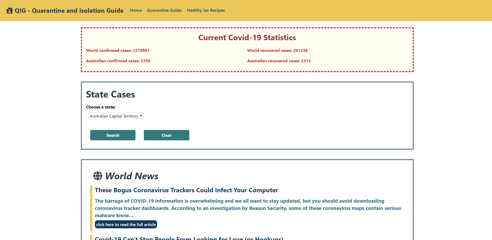
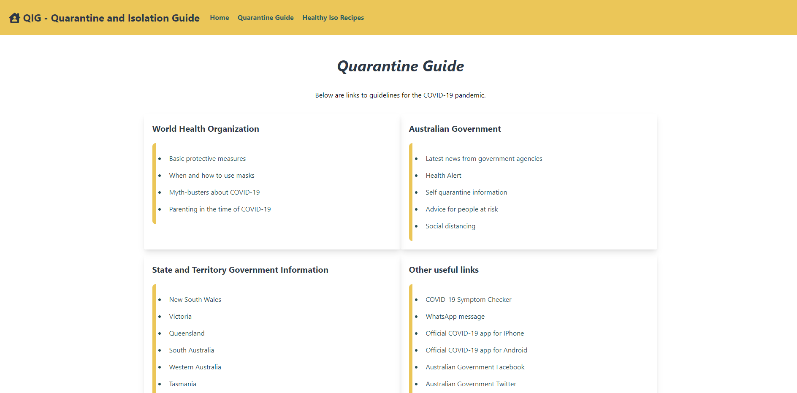
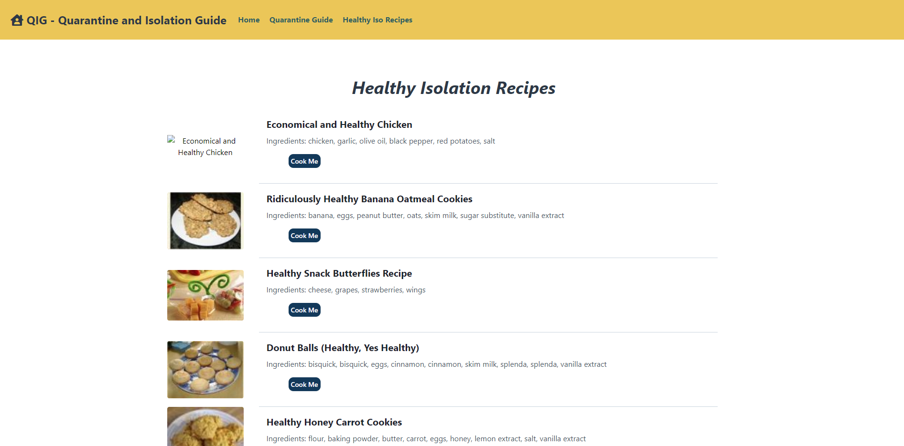
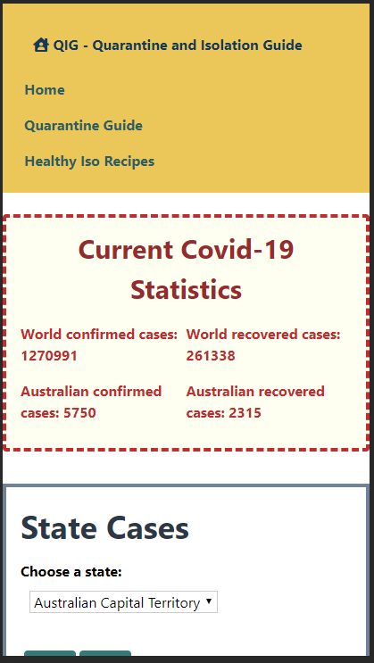
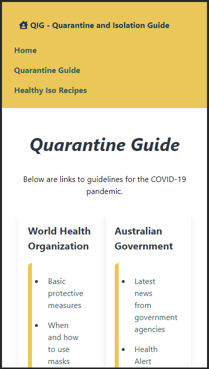

# Quarantine & Isolation Guide

## Overview
A web application designed to help people stay abreast of current news relating to the Coronavirus outbreak. It features world news and Australian news with the option of adding state based statistics also.

## Usage
Upon loading of the web application it will retrieve various statistics on the coronavirus and display at the top of the page. Beneath this it will dynamically create news articles seperated by categories with links back to the host sites. There is a drop down menu that allows users to specify which state they'd like to see specific statistics for.

## Link to Deployed Application
[View here](https:///)

### Desktop Screenshots

### Mobile Screenshots

## Credits
HTML & CSS by Ana Marr & Ziyen Loh
Javascript by Astrid Suhartono, Karthik Kovi, Omar Thayer & Matthew Teague
JQuery Library is the property of their creators/distributors and we claim no credit in their creation or distribution.
Corona-api is the property of their creators/distributors and we claim no credit in their creation or distribution.
News API is the property of their creators/distributors and we claim no credit in their creation or distribution.
Images are the property of their creators/distributors and we claim no credit in their creation or distribution.
All images used are available under the Creative Commons License.
